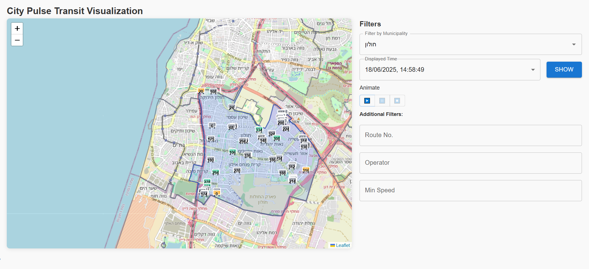

# 🚍 City Pulse – Real-Time Public Transit Visualization

A prototype web application that animates **real-time public transit data** (SIRI) on a map, with support for **time-lapse playback** and **spatial filtering by municipality**.

---

## 📸 Demo

---

## 📌 Assumptions
- Past data doesn’t change.  
- SIRI JSON files contain snapshots of vehicle states at regular intervals (file name = timestamp).  
- Each record contains sufficient information (lat/lon, operator, vehicle ref, line ref) to reconstruct vehicle movement over time.  
- Municipality boundaries in the provided GeoJSON align with the coordinate system of the SIRI data (**WGS84**).  

---

## 🔄 SIRI Data Processing
1. **Parsing**: Extract `MonitoredVehicleJourney` objects from JSON snapshots.  
2. **Data Validation**: Filter out records with invalid coordinates (`null`, `undefined`, or non-finite values).  
3. **Data Enhancement**: Create unique vehicle identifiers by combining operator, vehicle reference, and departure time.  
4. **Temporal Organization**: Store parsed data under timestamp keys for efficient time-based retrieval.  

---

## 🛠️ Technologies Used

### Frontend Stack
- **React 18** – Component-based UI with hooks for state management.  
- **TypeScript** – Type safety and better developer experience.  
- **Redux Toolkit** – Centralized state management with RTK Query for API operations.  
- **Material-UI** – Modern, accessible UI components.  

### Mapping & Visualization
- **Leaflet** – Lightweight, performant mapping library.  
- **React-Leaflet** – React bindings for Leaflet maps.  
- **Turf.js** – Geospatial analysis (point-in-polygon, bounding box calculations).  
- **Custom SVG Icons** – Dynamic bus icons with speed-based color coding and route number display.  

### Data Management
- **RTK Query** – Efficient data fetching with caching and lazy loading.  
- **Reselect** – Memoized selectors for optimized re-renders.  
- **Client-side Processing** – Spatial and temporal filtering performed fully in-browser.  

---

## 🚀 Improvements for Production
- **Performance**: Offload SIRI data parsing and spatial operations to server-side with **PostGIS** or similar spatial databases.  
- **Data Streaming**: Use **WebSockets** for live updates instead of polling.  
- **Caching Strategy**: Employ **Redis** for frequently accessed municipality boundaries and vehicle routes.  
- **Microservices Architecture**: Separate services for ingestion, spatial processing, and client delivery.  
- **Monitoring**: Real-time application performance tracking and alerting.  

---

## 📂 Data Sources
- **SIRI JSON** snapshots: `s3://eliabs-siri-ex/siri-data/`  
- **Municipality GeoJSON**: [GeoJSON link](https://eliabs-siri-ex.s3.eu-west-3.amazonaws.com/municipalities_multi.geojson)  

---
